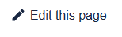

# IgorBox Support

This is the source for the **IgorBox documentation site**, hosted at <https://help.igorbox.com>.

It covers IgorBox Studio, the controllers (Output 8 MKII, Input 16, LED Controller), legacy products, and common use cases. The site is built with [Docusaurus 3](https://docusaurus.io/), a modern documentation website generator.

## Contributing Changes and Updates

This repository is open so _you_ can submit updates and fixes to the documentation. While we, at IgorBox, strive to keep the documentation accurate and up-to-date, sometimes we miss things or create typos. You can help us fix them in two ways.

1. [**Opening a Pull Request**](#submitting-a-pull-request) (preferred)
1. [**Creating an Issue**](#creating-an-issue)

### Submitting a Pull Request

This is by far the best way to get updates in as fast as possible.

You can do this using the standard GitHub flow of:

- fork the repository
- create a branch
- make your changes
- open a pull request from your branch to our `main` branch

A member of the team will review your changes and implement them as soon as practical.

Additionally, every page on the live site has an **"edit this page"** button that takes you straight to the source of the page you're looking at — the fastest way to fix a typo.



### Creating an Issue

If you find an error or omission, visit <https://github.com/RisingOrchards/igorbox_support/issues> and create an issue. Please include the URL of the page and a detailed description of the problem.

A member of the team will prioritize your change and get it updated as soon as practical.

## Local Development

### Requirements

- [Node.js](https://nodejs.org/) 18 or newer
- [Yarn](https://yarnpkg.com/) (this project uses Yarn — see `yarn.lock`)

### Install dependencies

```bash
yarn
```

### Run the development server

```bash
yarn start
```

This starts a local development server on port **4000** and opens a browser window. Most changes are reflected live without restarting the server.

### Build a production bundle

```bash
yarn build
```

This generates static content into the `build/` directory. You can preview the built site with `yarn serve`.

## Repository Layout

| Path | What's there |
| --- | --- |
| `docs/` | The documentation content (Markdown / MDX), organized by Studio, controllers, use cases, and legacy products |
| `blog/` | Blog posts |
| `src/` | Custom React components, pages, and CSS |
| `static/` | Static assets such as images served as-is |
| `plugins/` | Custom Docusaurus plugins |
| `docusaurus.config.js` | Site configuration (navbar, footer, plugins, metadata) |
| `sidebars.js` | Sidebar / navigation structure |

## Deployments

- **Production:** Merges to the `main` branch deploy automatically to <https://help.igorbox.com> via Vercel.
- **Previews:** Every pull request gets a Vercel preview deployment. A comment with the preview URL is added to the PR so you can see your changes before they go live.
