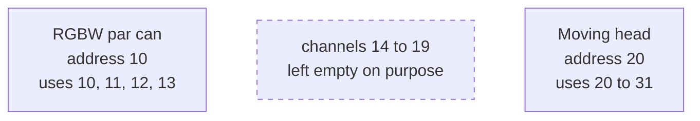
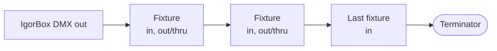

# DMX Basics

DMX is the standard control language for stage and effect lighting. If you've never touched it before, this page is everything you need to wire and address your first fixtures with confidence. If you've run DMX before, skim the [addressing advice](#leave-gaps-when-addressing) anyway. It'll save you a debugging session someday.

## One universe, 512 channels

A DMX **universe** is a single run of cable carrying 512 **DMX channels**. Each channel holds one level. Think of it as one fader on a lighting desk. A fixture listens to one or more consecutive channels: a simple dimmer might use one channel, an RGBW par can uses four (red, green, blue, white), and a moving head can use a dozen or more.

The IgorBox DMX drives one full universe: all 512 channels, refreshed continuously.

## Addresses

Every fixture has an **address**: the first DMX channel it listens to. The fixture then uses however many consecutive channels it needs from that starting point.

For example, an RGBW par can set to address **10** uses channels **10, 11, 12, 13**. The next fixture must be addressed at 14 or higher. If it overlaps, both fixtures respond to the same channels and neither does what you want.

You set the address on the fixture itself (DIP switches, a menu, or a remote tool, depending on the fixture) and tell IgorBox Studio about it when you [patch the fixture in](/docs/studio/dmx/patching-fixtures). The two must match. The address on the fixture is the truth; the Studio just needs to know it.

## Leave gaps when addressing

Here's the advice that isn't in most fixture manuals: **leave a few unused channels after every fixture.**

Some fixtures quietly listen to more channels than their manual admits: extra features, diagnostic functions, or even configuration settings living on channels past the documented ones. If another fixture is addressed right up against them, its perfectly normal show data lands on those hidden channels and the first fixture starts doing things nobody programmed. This can look like the fixture is broken, or "glitching," or possessed. It isn't. It's reading its neighbor's mail.

Space is cheap: you have 512 channels and most rigs use a fraction of them. Address your fixtures with room to breathe and this entire class of gremlin never visits.



## Chaining fixtures

DMX runs in a daisy chain: controller → first fixture's **in**, that fixture's **out** (or **thru**) → next fixture's **in**, and so on down the line.



- Chain order doesn't matter for addressing. A fixture at address 10 works the same anywhere in the chain.
- Don't split the cable into a Y. DMX wants one continuous chain. If you need branches, use a DMX splitter made for the job.

## Termination

The last device in a DMX chain should be **terminated** with a small plug (or built-in switch) that stops the signal from reflecting back up the cable and garbling itself. Short chains often work without it; long chains and picky fixtures will make you regret skipping it.

The IgorBox DMX has its own **built-in terminator you can [switch on from the Studio](/docs/studio/dmx/patching-fixtures#input-termination)** on the **Input**, no plug required. Use it when the controller sits at the end of a chain (for example, in [Fixture or Buffer mode](modes) where the chain arrives at the box). When the controller is the start of the chain (the usual case), terminate at the far end: the last fixture.

In Buffer mode this is crucial. The console's chain **ends** at the IgorBox input, and the output sends a fresh copy of that universe onward to your fixtures.

:::tip Use the internal Terminator for Small Loops
If you're running in **Standard mode** and have a relatively small distance of fixture run, you can just run the output of your last fixture back to the input of the IgorBox Controller. This will use the internal terminator on that input jack as the terminator for your universe
:::

The terminator's state is always visible on the panel: green means on, red means off. See [Indicator Lights](/docs/controllers/shared/indicator-lights).

## Refresh rate

The controller repeats the whole universe many times a second. That's the **refresh rate**, and you can [choose it in the Studio](/docs/studio/dmx/patching-fixtures#refresh-rate):

| Rate | When to use it |
| --- | --- |
| 30 per second (default) | The right choice for almost every system. A good balance of fade speed with compatibility |
| 44 per second | Fastest response, for rigs that want the snappiest possible chases |
| 20 / 10 per second | Troubleshooting: some older or quirky fixtures behave better at a slower pace |

The front panel shows the current rate at a glance. See [Front Panel](front-panel).

## Cables

We support two ways to connect your DMX fixtures to the IgorBox DMX: XLR and WAGO.

The first is 3-pin XLR cables. These are microphone cables for all intents and purposes and are pretty easy to find.

:::note But I thought DMX is 5 pin?
Yes, the DMX "official spec" is 5 pin XLR connectors and many professional fixtures use 5 pin connectors. The 5 pin connectors still only use 3 conductors and are chosen to prevent a rigger at a concert from plugging a microphone cable with 48v of phantom power into a DMX device. Over the years, this has proven to not be a problem in practice, and 5 pin cables were hard to come by in live concert environments. So many manufacturers just started supporting 3 pin XLR and a majority of fixtures only have 3 pin XLR connections now. You can get adapters for 3 pin to 5 pin and back pretty easily.

We originally spec'd a 5 pin and 3 pin configuration on the controller, but discovered we just didn't have the space for 2 sets of XLR connectors. So we chose compatibility over adapters.
:::

99% of users will likely use the 3-pin XLR. For those of you that need a more direct wired solution, we also break out our Input and Output via 3 pin WAGO connectors on the back panel.

The configuration of the Connector is: Positive, Negative, Ground (or B, A, GND):

```
|---|---|---|
| B | A | G |
|---|---|---|
```

These WAGO connectors are directly tied to the XLR connector so you can choose either one, or if you need to tap off you can use both like in the case of fixture mode without termination.
