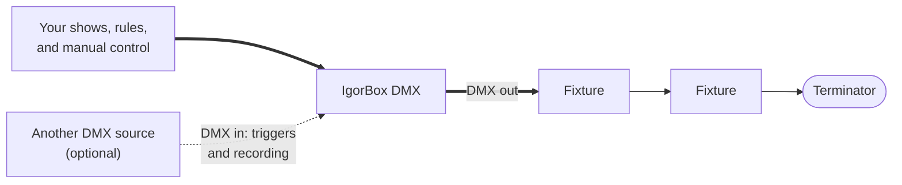
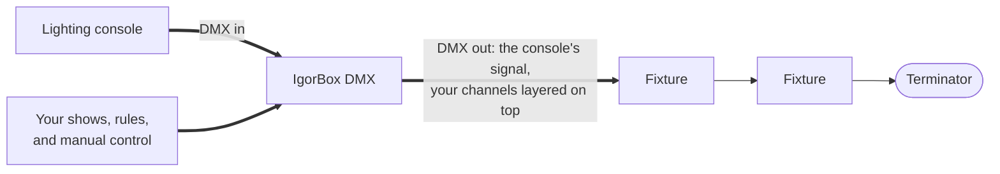
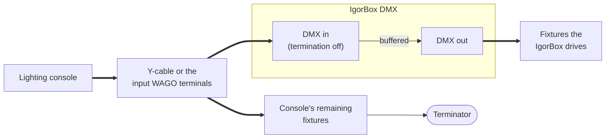
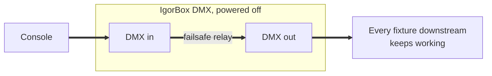
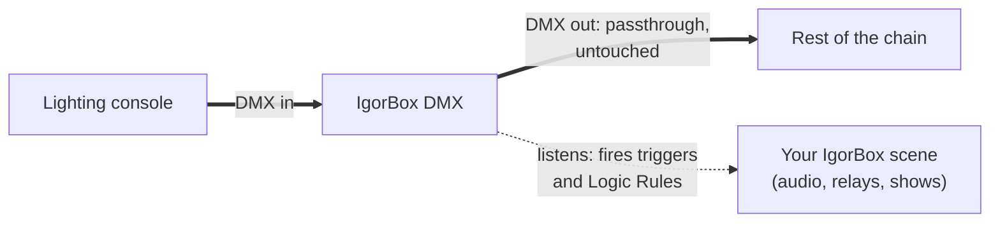
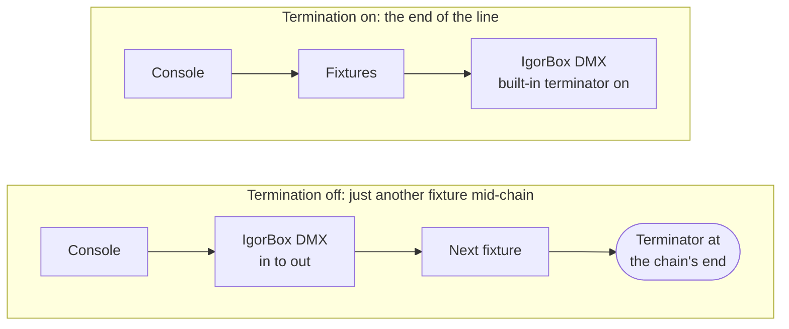

# Operating Modes

The IgorBox DMX can play three different roles in a rig. You pick the mode on the controller's **Configuration** tab in IgorBox Studio, in the [DMX section](/docs/studio/dmx/patching-fixtures#operating-mode), and the panel lights always show which mode you're in ([Indicator Lights](/docs/controllers/shared/indicator-lights)).

| Mode | The box is... | DMX out carries | DMX in is used for |
| --- | --- | --- | --- |
| **Standard** | the source of the universe | your IgorBox shows | triggers & recording (optional) |
| **Buffer** | between a console and the rig | the console's signal, with IgorBox overriding just its own channels | the console's signal |
| **Fixture** | a listener anywhere on someone else's chain | nothing (in is hardwired straight to out) | triggers |

## Standard

The everyday mode. Your IgorBox owns the universe: shows, [manual control](/docs/studio/manual-control), and Logic Rules drive the fixtures, and nothing else is expected on the line.

You can still enable the DMX input in Standard mode. Incoming DMX doesn't reach your fixtures, but it can fire [Logic Rules](/docs/studio/logic-rules/overview) and be recorded.

## Buffer

The mode for rigs you don't fully own. The IgorBox sits **between** an existing lighting console (or another controller) and the fixtures:

- Everything the console sends passes through to the fixtures, untouched.
- The moment an IgorBox show, rule, or manual-control session uses a DMX channel, IgorBox **takes over just that channel** while the console keeps driving everything else.

This is how you add scares to a rig that already has an operator: the house look stays on the console, and IgorBox reaches in for exactly the fixtures your scene needs, exactly when it needs them.

:::warning
In Buffer mode the box expects to be the **end of the console's run**: the incoming chain terminates into the IgorBox, and a fresh, buffered copy leaves on DMX out. That's why the internal terminator is on by default.

**Most rigs never need this next part.** Only lift the terminator if some of the console's fixtures must sit *past* the tap point and receive the raw console signal rather than the buffered copy. The input then becomes an inline tap (a listening point in the middle of the chain instead of the end of it), and you carry the signal onward yourself: from the input WAGO terminals (they're wired to the same line as the input XLR) or with a Y-cable on the input XLR. If you think you need this and have questions, [contact us](/docs/contact)!

:::

## Failsafe Buffer Operation

When an IgorBox DMX is offline, the Input and Output are connected together electrically through physical relays internally. When the controller boots up, it establishes the input stream, sets up its internal buffer and then breaks the electrical connection to start sending its buffer on the output side.

This means that if you are buffering a universe through the IgorBox DMX and the controller loses power or reboots for some reason, the universe being buffered is sent downstream until the controller comes back up and takes over the buffering operation. The end result is everything continues to work.

## Fixture

The box behaves like a fixture in someone else's chain: it **listens**. Incoming DMX can fire [Logic Rules](/docs/studio/logic-rules/overview), like "when the console brings channel 40 above 50%, trigger my show." Meanwhile the DMX in is hardwired straight through to the DMX out, so the chain continues past the box as if it weren't there.

Use it to make a console cue the trigger for an entire IgorBox scene: audio, relays, and all.

:::info
In this mode the input and output are electrically connected and the box's own transmitter is silent. The terminator decides where the box sits: **on**, and the controller is the end of the line; **off**, and it's just another fixture in the middle, with DMX out continuing to the next fixture in the chain.

:::

## Recording

In **Buffer** mode, or **Standard** mode with the DMX input enabled, the IgorBox can **record incoming DMX**: capture what a console (or a rented programmer's board) is sending, then turn it into an IgorBox show you can edit and replay. Fixture mode can't record; its hardware passthrough bypasses clean capture. See [Recording from a Console](/docs/studio/dmx/recording).
