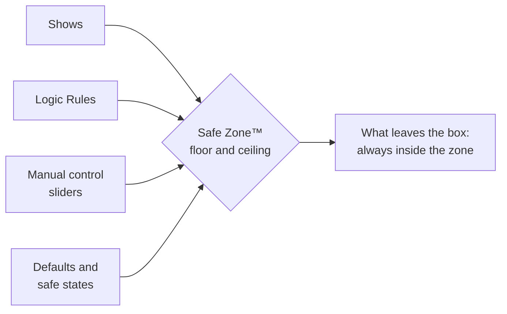

# Safe Zones™

A **Safe Zone™** is a limit you set on a DMX channel (a floor, a ceiling, or both) that the controller enforces against everything. Shows, Logic Rules, manual-control sliders: no matter what asks, the value that leaves the box stays inside the zone.

## Why you'd want this

Some DMX devices move. A servo-driven animatronic, a moving head beside a wall, a prop with real mechanical stops: for these, a DMX value isn't just a brightness, it's a **position**, and an out-of-range position can grind a servo, hit scenery, or damage the prop.

Set a Safe Zone™ once, on the controller, and the mechanical limits are enforced at the last possible moment. They hold even if someone later edits the show wrong, drags a slider too far, or a rule misfires. The prop physically can't be asked to hurt itself.

With Safe Zones™ set, the editor won't let you draw a show outside the range, so keyframe data stays within limits. A value can still slip through in other ways (a [Channel Discovery™](/docs/studio/dmx/channel-discovery) probe, for example, can ask for a value outside a known good limit). In those cases the hardware still enforces the zone. If a servo's Safe Zone™ is 50 to 128 and a show frame, manual control, or a discovery request asks for 0, the controller sends 50, the lowest value the zone allows. This safeguard lives in the hardware to protect your valuable moving props. 

## What it covers

- Values from **shows**, **Logic Rules**, and **manual control** are all clamped to the zone.
- Fixtures that use two paired channels for extra-fine movement (common for pan/tilt on moving heads and for servo props) are handled as a single value. The pair is clamped together, so the fine channel can't sneak a position past the limit.

:::danger Buffer Mode Bypasses Safe Zones™
When in buffer mode and the IgorBox DMX is not actively controlling the channel, it **will not** enforce safe zones. It is passing your upstream data untouched.
:::

## Setting them up

Safe Zones™ are set per channel in a fixture's channel layout: a **Safe min / Safe max** pair on any dimmer, pan, or tilt channel. Proportional channels (the kind used for DMX servo props) get theirs automatically: the movement band you configure *is* the zone. See [Fixture Channels](/docs/studio/dmx/fixture-channels#safe-zones) for where to edit them, and note that fixture-library profiles can ship with zones already filled in.

:::tip Set limits before you program
Dial in Safe Zones™ right after you patch a mechanical fixture, *before* building shows for it. Then program fearlessly. The rails are already up.
:::
