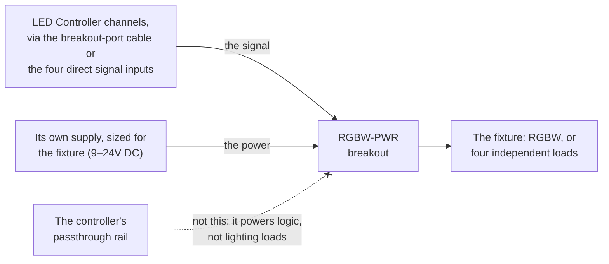

# RGBW-PWR Breakout

The RGBW-PWR breakout is a **power version of a 4-channel breakout board**. The LED Controller's channels are signal-level (clamped at 20 mA) — fine for indicators and SSR inputs, but not enough to drive a real lighting load directly. The RGBW-PWR adds a power stage so that **four channels** can drive a load at **higher current, or at a different DC voltage** than the controller's own channels.

It's named for its typical job — driving an RGBW fixture (Red, Green, Blue, White on four channels) — but the four channels can just as well be four independent single-color loads.

## Two ways to use it

**As a channel breakout (channels 9–16).** Use it in place of a [standard breakout board](channel-breakouts) for the 9–12 or 13–16 bank. It plugs into the controller's breakout port with a **standard Ethernet cable**, exactly like a standard breakout — same cable, no networking, nothing to provision. The difference is purely that its four channels can drive a powered load.

**Direct-wired to channels 1–8.** The board also has **four individual signal inputs**, so you can wire any four of the onboard channels (1–8) straight into it. Use this when you want powered output on channels that live on the main box rather than on a breakout bank.

Either way, the four channels look like ordinary channels in Studio — same envelopes, same dimming, same color behavior. The only thing that changes is how much current they can push and at what voltage.

## Power for the breakout

The RGBW-PWR has its **own power input** (9–24V DC), and that input sets the voltage and current available to its four channels — independent of the LED Controller's channel voltage.

**Do not power it from the LED Controller's passthrough** — that rail is sized for the controller's logic, not for a lighting load. Give the breakout its own supply, sized for the fixture.

A typical install:

- Load supply → RGBW-PWR power input → fixture
- LED Controller runs on its own small logic supply; the breakout carries the load.

## Limits

- **2A per channel**, and **5A total across the board.** With all four channels loaded, that's an average of 1.25A each — fine for most fixtures, but size your loads so the board total stays under 5A. At 24V that 5A works out to about **120W** of total load per board.
- **9–24V DC.** Output voltage is whatever you feed the breakout's own power input, anywhere in the 9–24V DC range — and it can be different from the LED Controller's own supply voltage. Run a 24V fixture off the breakout even if the controller is on 12V.
- **DC only.** Same as the controller's onboard channels.

## Order one

The breakout is sold separately. See the [IgorBox Store](https://store.igorbox.com/shop/rgbw-pwr-rgbw-power-injector-139) for current pricing and availability.
