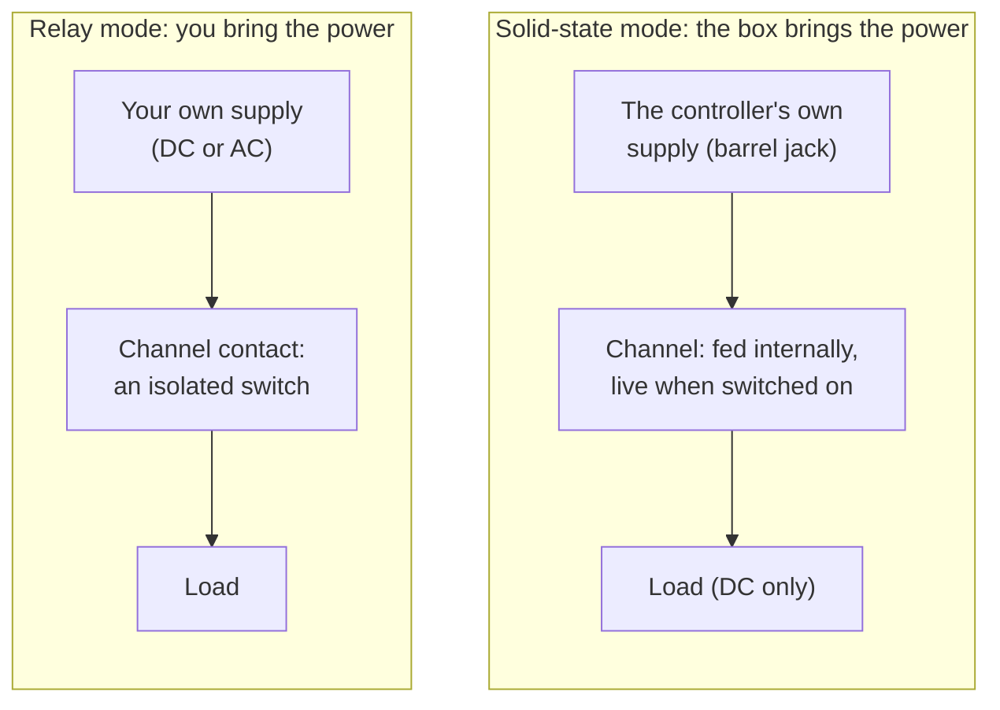

# Multistate Relay™

The big feature on the Output 8 MKII is **Multistate Relay™** — six of the eight output channels can act as either a standard mechanical relay _or_ a solid-state output, and you flip between them in software.

In Standard relay mode, you have a bare contact relay. You can use it like a light switch. If you switch to "Solid State" mode, the power that you use to power the controller is passed through to the channel's output. You can use this to activate solenoids without jumper wires.

Both modes switch ON and OFF — the difference is what's on the terminals. Relay mode gives you an isolated dry contact you pass your own power through. Solid-state mode hands you the controller's own supply voltage, already live, so you can drive a load straight off the box.



## Why it matters

Traditional show controllers make you commit to a channel type when you order the box. Want an isolated dry contact on channel 5? Order the relay version. Want a powered output on channel 6 so you can fire a solenoid without running extra power wires? Order the solid-state version. Need both? Order two boxes.

Multistate Relay™ collapses the decision. The same Output 8 MKII can run a haunt scene with:

- **Channel 1 (relay mode)** — switching a 24V pneumatic monster fed from its own supply
- **Channel 2 (solid-state mode)** — powering a panel light straight off the controller, no jumper wiring
- **Channel 3 (relay mode)** — switching a 12V mister on an isolated contact
- **Channel 4 (solid-state mode)** — firing a 24V solenoid directly from the box's power
- **Channel 7 (standard 3A relay)** — kicking a high-inrush wiper motor
- **Channel 8 (standard 3A relay)** — switching a 24V show-control beacon

All on one box. All from one show in the timeline editor.

## When to use which mode

- **Relay mode** — when the load brings its own power, runs on AC, or needs to be electrically isolated from the controller. The channel is a bare contact: you pass your own power through it, just like a switch.
- **Solid-state mode** — when the load runs on the same DC voltage as the controller and you want to power it straight from the box. The channel sources the controller's supply, so the output is already live when it switches on — no jumper wires from the passthrough zone. DC only.

Each Multistate channel is rated for **1.5A** in either mode. If you need more current, use channels 7 or 8 (the standard 3A relays).

## Flyback Diodes

:::warning
There is no flyback protection provided at the connector. This was intentional because we want IgorBox to be as versatile as possible. This means that if you're switching solenoids or other inductive loads, you should use a flyback diode installed close to the inductive device (like a solenoid) or at least add a flyback diode to the connector as a last resort. It's always better to put this as close to your solenoid as possible to prevent radio interference and other transient issues. 

The diode should be configured so that the side with the line (cathode) is on the positive wire and the other side (anode) is on the negative wire. 

If you need help with this or have additional questions, please contact us! We're here to help!
:::


```
   IgorBox channel (Solid-State mode)

   (+) ●──────────────┬──────────────┐
                      │              │
                   ═══════  ◄ STRIPE / line end (this end to +)
                    DIODE            ▓
                    ──┬──            ▓   SOLENOID
                      │              ▓
   (−) ●──────────────┴──────────────┘

```

A good "all around" Diode for this is the [1N5408](https://www.amazon.com/EEEEE-1N5408-Rectifier-Electronic-Silicon/dp/B0FC2917XJ) rectifier diode. You can buy packs of 50 of them for less than $10.. If you drop a note on your order, we'll give you a bunch for free. 

:::info
The diode is not strictly required and the IgorBox will be fine if you don't use one, but for the longevity of your connected devices and integrity of adjacent devices that may not reject radio interference well, we **strongly suggest** you consider putting in a diode as a cheap insurance.
:::

## Switching modes

Open the controller in Studio, go to the Configuration tab, and click the channel. Pick the mode and Studio pushes the change to the controller right away.

Don't switch modes mid-cue — the channel needs a moment to transition.

## Limits

- **Voltage**: 9–24V DC working range. Don't run mains through any IgorBox.
- **Solid-state output voltage**: whatever you feed the controller's supply. The channel passes the box's own power through, so it can't output a voltage you aren't already supplying.
- **AC loads**: only on relay-mode Multistate channels and on the two standard 3A relays — those are dry contacts. Solid-state mode sources the controller's DC supply, so it's DC only.

## See also

- [Wiring Guide](wiring-guide) — example wiring for both relay-mode and solid-state-mode loads
- [Tech Specs](tech-specs) — current and voltage ratings for every channel
