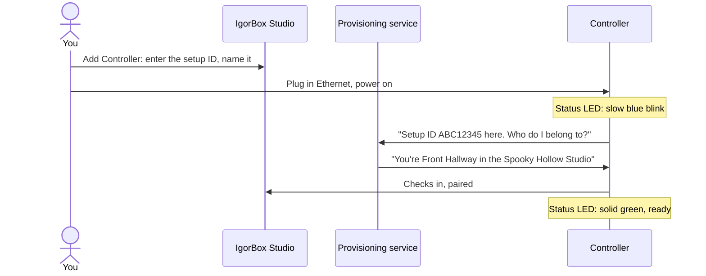
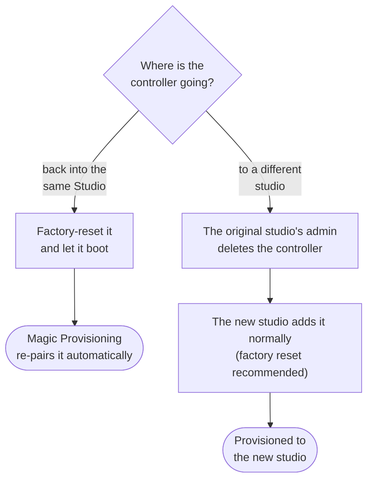

# Magic Provisioning

Magic Provisioning is how you connect a brand-new controller to your IgorBox Studio. There's no IP configuration, no USB cable, no captive portal. You read a short code off the device, type it into Studio, and you're done.

## What you need

- A powered controller, online (Ethernet plugged in, or WiFi already configured — Magic Provisioning can configure your WiFi too)
- Access to your IgorBox Studio at `https://<your-org>.igorbox.studio`
- A user account that's allowed to add controllers

:::tip
Add your WiFi credentials to your Studio account under **Studio Settings** _before_ provisioning your controller. When it provisions, it will pick those up automatically — you can unplug the ethernet afterward and it'll roam to WiFi on the next boot.

No Ethernet at the controller at all? Use the [IgorBox Connect](igorbox-connect) app to set its WiFi over Bluetooth from your phone, then provision as normal.
:::

## Step by step

1. **Sign in to Studio** and click **Add Controller**.
1. **Enter the setup ID** — eight characters, like `ABC12345` (found on the serial number sticker).
1. **Name the controller** ("Front Hallway", "Coffin Room", "Basement Audio"). Add tags if you want to filter later.
1. **Plug your controller into your router** — Ethernet to your router or switch with internet.
1. **Power the controller on.** When it boots it will use our secure provisioning service and handle configuring itself for your account.

That's it. From now on, the controller belongs to your account until you remove it.

Here's what "it handles configuring itself" actually looks like:

## About the setup ID

The setup ID is **unique to each controller** — eight uppercase characters, the same every time.

A controller can only belong to one studio at a time. Once you add it to your Studio, it stays with your account until a studio admin removes it.

## What you'll see on the device

While the controller is searching for your account, the [status LED](status-led) will be a **slow blue blink** — the same indicator the controller uses any time it's online locally but not yet talking to the cloud. Once Studio accepts it and the controller is paired, the LED goes solid **green** (Idle / Ready).

If it stays in slow blue blink for more than a couple of minutes after you've added the controller in Studio, check the troubleshooting list below.

## Troubleshooting

| What you see | What's likely happening |
| --- | --- |
| You typed the setup ID in Studio but Studio doesn't find it | The controller may already be associated with another Studio account (common with second-hand hardware). [Contact support](/docs/contact) and we can help sort out the transfer. |
| Setup ID typo | The setup ID is case-insensitive, but the digits matter. Re-read the sticker. |
| Controller stays in slow blue blink after you've added it in Studio | The controller can't reach our provisioning service. Check the [Connectivity](connectivity) requirements (DNS, outbound HTTPS to the IgorBox domains). If you're on WiFi, plug in ethernet temporarily — provisioning is much more forgiving over a wire. |
| LED stays orange (slow breath) for more than ~30 seconds | The controller didn't get past boot. Power-cycle it. If it persists, see [Error Codes](error-codes). |
| LED is solid red and blinking in bursts | Hardware error during boot. Count the blinks per burst and check [Error Codes](error-codes). |

## Re-provisioning a used controller

There are two different scenarios — and they need different steps.

**Re-pairing the controller with the same Studio** (e.g., after a factory reset to clear local config, or to recover from a problem) — do nothing special. Just [factory-reset](front-button) the controller and let it boot. The controller stays registered in your Studio, and Magic Provisioning will re-pair it automatically the next time it's online.

**Moving the controller to a different studio** — the original studio's admin needs to **delete the controller** from their Studio first. Once it's been removed there, the new studio can add it normally. (A factory reset on the device is recommended at that point to wipe leftover content.) If you're acquiring used hardware and the previous owner isn't reachable, [contact support](/docs/contact) and we'll help you get it transferred. The setup ID stays the same throughout — it's tied to the hardware.

