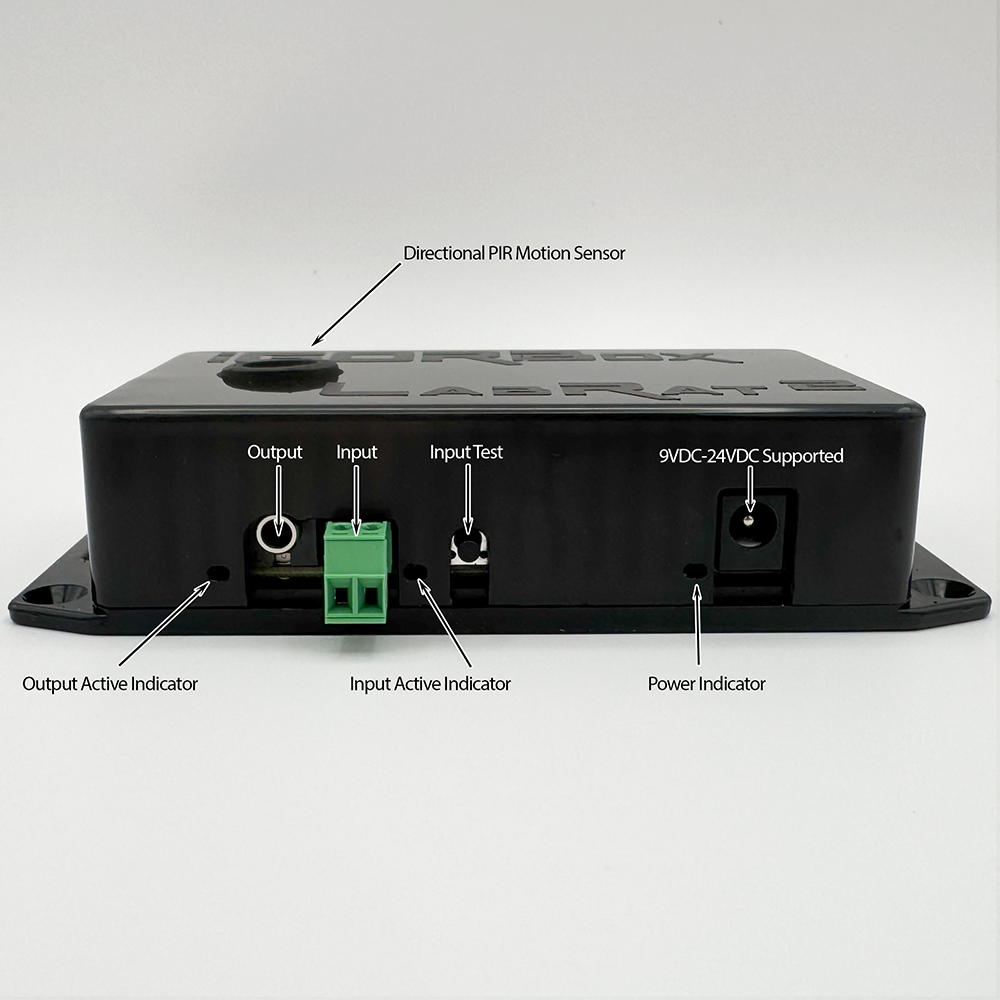
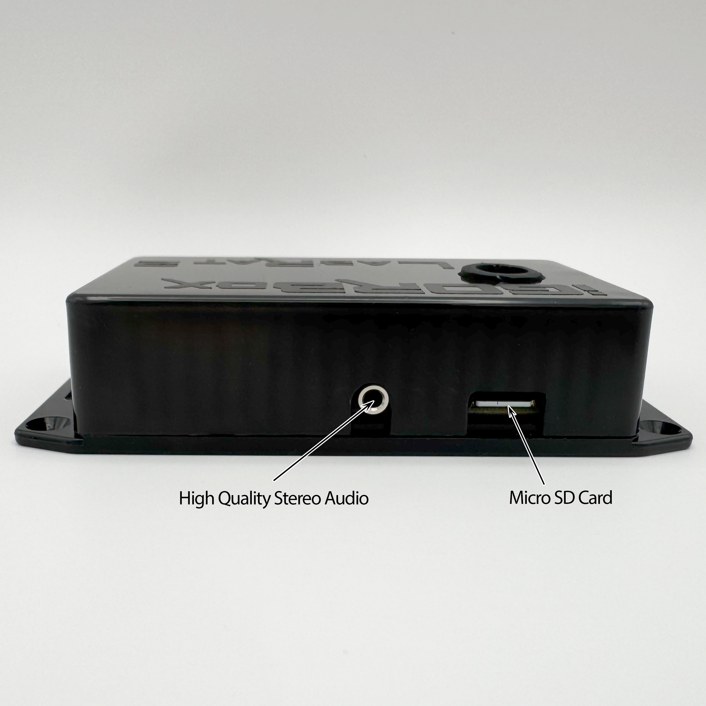

# Overview

:::info Legacy product
The LabRat G2 is no longer in active production. These docs remain for existing customers.
:::

The LabRat G2 is a total redesign of the LabRat with the same 1 input, 1 output, and PIR motion sensor, but it upgrades the processing power, and adds WiFi networking, high quality stereo audio, and micro SD Card expansion.

## Front Panel

We used a different connector for "input" vs "output" and we added an LED indicator to address confusion caused by the original LabRat.

We kept the 3.5mm mono connector for the output because it's the most compatible with the most props out there. You can buy any male to male 3.5mm audio cable to plug the LabRat into many commercially available prop trigger inputs.

_(We provide a 3.5mm terminal block if you need something different)_

For the input, we have a pluggable terminal block now. We did this for 2 reasons. The first of which is it reduces confusion and the second, and more important, is that it's more compatible than the old 3.5mm jack we used.

We also added an additional LED indicator so we can indicate more clearly what is going on. Is the input active? how about the output? Now you know!

## Back Panel

On the back panel you'll see two new additions over the original G1 LabRat. We added high quality stereo line out and a micro SD Card slot.

The audio circuit is and components are ripped directly from our flagship IgorBox which has been proven to perform with an ultra low noise floor. Combine this with our support for high bitrate MP3, Wav, and FLAC file formats, and you have the best sounding prop in your haunt!

The Micro SD Card slot is "overbuilt" with SDMMC. This is a high performance protocol that enables our high quality audio playback without artifacts or skipping. Basically, we can feed large amounts of audio data to the speakers.

## Where's the Screen and Knob?

We listened to your feedback and removed them! Plus, with all the new functions like audio playback, ambient mode, and the new "IgorBox" mode, it really got complicated with all the menu juggling.

### How do I program it now?

You can do it through the SD Card or you can connect your LabRat to IgorBox and manage it like you manage all of your other IgorBox controllers!

:::info
Don't worry! We have a "Configurator" to let you easily manage the configuration that goes on the SD Card.
:::

Read about configuring your LabRat [here](configuration)

## Motion or No Motion?

Believe it or not, some people don't want to pay for things they don't need! So we heard you, and we are now offering a discounted model without the onboard PIR motion sensor.

On the subject of the motion sensor, we got a lot of great feedback on our enhanced PIR sensor design that is more directional than your standard "off the shelf" motion sensors that are designed for home security. Ours are purpose built and designed to be much narrower of a detection field to reduce false firing.
