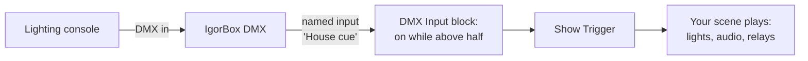

# DMX Input

The IgorBox DMX doesn't just talk. It listens. Incoming DMX (from a lighting console, another controller, anything upstream) can be monitored live, fire [Logic Rules](/docs/studio/logic-rules/overview), and be [recorded into a show](recording).

## When the input is live

- **Buffer** and **Fixture** modes always listen; that's their nature.
- **Standard** mode listens only when you flip on **Enable DMX input** in the controller's [DMX configuration](patching-fixtures#dmx-input).

See [Operating Modes](/docs/controllers/dmx/modes) for the full mode picture. Note that Fixture mode makes a perfectly good *pure input*: the output stays silent, but everything arriving on the input is readable, so a console cue can trigger an entire IgorBox scene.

## Named inputs

Raw slot numbers make for unreadable rules, so you can name the incoming slots you care about. In the controller's DMX section, whenever the input is live, a **Named DMX inputs** list appears: give slot 40 the name "House cue" and every rule that watches it says so. Up to 32 named inputs per controller.

Names are labels for IgorBox Studio's benefit. They don't change what the controller receives, and saving them doesn't need a controller update.

## Watching it live

When the input is live, the controller's **Overview** tab grows a **DMX In** panel:

- Your **named inputs** listed with their live values, the quickest way to check that a console cue actually arrives.
- **View Universe State**: the whole incoming universe as a heatmap, with an **Idle** / **active** badge counting non-zero slots. Hover any cell for its slot and value.

## Triggering rules from DMX

The **DMX Input** block in [Logic Rules](/docs/studio/logic-rules/node-reference#dmx-input) watches one incoming slot (a named input or a raw slot number) and stays on while the value sits inside a range you choose. "When the console pushes House cue above half, play the lobby scene" is a two-block rule: DMX Input → Show Trigger.

Rules can also *drive* DMX: the [DMX Slot Hold and DMX Fixture Hold](/docs/studio/logic-rules/node-reference#dmx-slot-hold) blocks pin channels at a value until released.

:::note
DMX inputs work through Logic Rules only; they don't appear in the simple [Triggers](/docs/studio/triggers) picker, which is for physical wired inputs. The rule above is as small as they come, though.
:::

## Recording

The input's party trick: capture what a console sends and turn it into an editable IgorBox show. That gets [its own page](recording).
