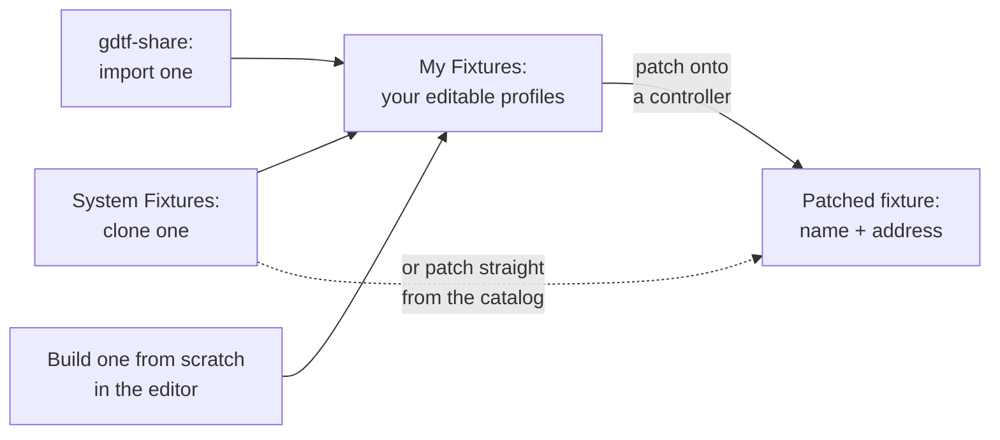

# The Fixture Library

A **fixture profile** describes a model of fixture: its manufacturer and model, and one or more **modes**, the channel layouts the fixture can be set to (many fixtures offer, say, a 4-channel basic mode and a 12-channel extended mode). Each mode lists the fixture's channels in order: what each one is (dimmer, a color component, pan, a strobe-mode selector…) and how it behaves.

You manage profiles on the **DMX Fixtures** page in IgorBox Studio's main navigation. It has three tabs.

## My Fixtures

Your Studio's own fixture profiles. Everything here is editable: profiles you built from scratch, imported from gdtf-share, or cloned out of the system catalog.

- Search by name or manufacturer, and switch between a **Grid** and **Table** view.
- Each fixture offers **Edit**, **Duplicate**, and **Delete**.
- **New fixture** opens the profile editor (below).

## System Fixtures

The built-in, read-only catalog: profiles curated by IgorBox plus the community [Open Fixture Library](https://open-fixture-library.org/) and GDTF sources. Filter by source, manufacturer, and channel count.

You can't edit a system fixture directly; clone it instead. The clone lands in **My Fixtures** as your own editable copy, which is also the fastest way to build a "custom" profile: start from something close and adjust.

You don't need to clone just to *use* a system fixture; patching works straight from the catalog. Clone when you need to change something.

## gdtf-share

[gdtf-share.com](https://gdtf-share.com) is the lighting industry's community catalog for **GDTF** (General Device Type Format) fixture descriptions. Manufacturers and users publish ready-made profiles there, so you don't have to map every channel of every fixture by hand.

Because gdtf-share requires an account, each Studio connects its own:

1. Sign up (free) at gdtf-share.com.
2. On the **gdtf-share** tab, enter that username and password and click **Save & connect**. Only your Studio's admins can connect, replace, or disconnect the account. Credentials are stored encrypted and never shown again after saving.
3. Once connected, the tab becomes a catalog browser: search by name or manufacturer, filter by channel count.

For any fixture in the results:

- **Preview** shows the profile before you commit: its modes, every channel with its role, and any conversion warnings.
- **Import** converts it and drops it into **My Fixtures**, ready to patch and edit.

## Building your own profile

**New fixture** (on the My Fixtures tab) opens the profile editor:

- **Identity**: manufacturer and model. These are locked after the first save (they become the profile's permanent identity); to rename, use **Duplicate**. A free-form **Notes** field is a good home for wiring quirks and manual-mode settings.
- **Modes**: every profile has at least one. Give each mode a name (e.g. "8ch basic") and build its channel list in order with **Add channel**. The channel count (the fixture's *footprint*) is derived automatically. See [Fixture Channels](fixture-channels) for what each channel kind does.
- **Color groups**: when a mode has red/green/blue (plus white/amber) channels, they're grouped so the Studio can drive them as one color picker. A default group is created for you; you can split it up (for multi-head fixtures with independent color sections) or clear it.
- **Card image**: upload a photo after the first save.

Working from a fixture whose manual is missing or wrong? Click **Discover channels** in the editor to probe the real thing live; see [Channel Discovery™](channel-discovery).

Validation runs as you type: errors block saving; warnings don't.

## Profile edits don't chase your patches

When you save changes to a profile, controllers already patched with it **keep the layout they were patched with**; edits affect future patches only. That's deliberate: a library edit can't silently re-wire a controller mid-season.

To pull a profile update into an existing patch, use **Sync from library** on the patched fixture. See [Patching Fixtures](patching-fixtures#syncing-a-patch-with-the-library).
