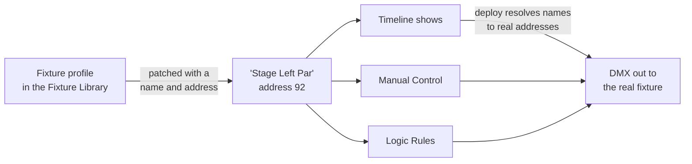

# DMX in IgorBox Studio

This section covers the Studio side of DMX: telling the Studio which fixtures you own, where they sit on the DMX chain, and driving them from shows, manual control, and Logic Rules.

For the hardware itself (wiring, chaining, termination, the operating modes), see the [IgorBox DMX controller docs](/docs/controllers/dmx/overview). If DMX is new to you, start with [DMX Basics](/docs/controllers/dmx/dmx-basics).

## The three layers

DMX in the Studio is built out of three layers:

1. **Fixture profiles** describe a *model* of fixture: "this par can has seven channels: red, green, blue, a dimmer, a strobe mode…" Profiles live in the [Fixture Library](fixture-library). A built-in catalog covers a huge range of commercial fixtures, and you can import or build your own.
2. **The patch** is per controller: *your* fixtures. Patching a fixture says "there's one of these at address 92, and I call it Stage Left Par." You patch on the controller's Configuration tab; see [Patching Fixtures](patching-fixtures).
3. **Shows, manual control, and rules** drive the patched fixtures. Once patched, a fixture shows up automatically in the [timeline editor](/docs/studio/timeline-editor/dmx-tracks), in [Manual Control](/docs/studio/manual-control), and as a target for [Logic Rules](/docs/studio/logic-rules/overview).

The payoff of the layering: you describe each fixture model once, patch it wherever it's used, and author shows against *names* ("Stage Left Par's dimmer") instead of raw channel numbers.

## Fixtures keep their identity

Shows and rules reference **the fixture**, not its DMX address. Rename "Stage Left Par" or move it from address 92 to 200, and every show that uses it keeps working; the Studio re-resolves the addresses when a show deploys. If you re-address fixtures that already-deployed shows are using, IgorBox Studio offers to redeploy those shows for you on the spot (see [Patching Fixtures](patching-fixtures#re-addressing-and-deployed-shows)).

## Where everything lives

| What | Where in IgorBox Studio |
| --- | --- |
| Fixture library (browse, import, build profiles) | **DMX Fixtures** in the main navigation |
| Operating mode, termination, refresh rate, the patch | Controller page → **Configuration** tab → **DMX** section |
| Live fixture control (sliders, color, pan/tilt) | Controller page → **Overview** tab, during [Manual Control](/docs/studio/manual-control) |
| Incoming DMX monitor | Controller page → **Overview** tab → **DMX In** |
| Show authoring | The [timeline editor](/docs/studio/timeline-editor/dmx-tracks), where patched fixtures appear as track groups |
| Recording from a console | The **Record** button in the timeline editor; see [Recording from a Console](recording) |
| DMX-driven logic | The DMX blocks in [Logic Rules](/docs/studio/logic-rules/node-reference) |

## The typical workflow

1. **Set the operating mode.** Standard if the IgorBox owns the rig, Buffer or Fixture if it's joining an existing console's chain. See [Operating Modes](/docs/controllers/dmx/modes) for what they mean, and [Patching Fixtures](patching-fixtures) for where to set it.
2. **Patch your fixtures.** Pick each fixture from the library, give it a name and its address.
3. **Verify with Manual Control.** Grab the sliders and color pickers on the controller's Overview tab and make sure every fixture responds at its address.
4. **Build a show.** The patched fixtures are waiting for you in the timeline editor, or [record one from a console](recording).
5. **Deploy.** Same as any other show; see [Deploys and Versions](/docs/studio/timeline-editor/deploys-and-versions).

:::note
DMX features appear in IgorBox Studio when your Studio has DMX enabled. If you have an IgorBox DMX and don't see the **DMX Fixtures** navigation entry or the **DMX** section on the controller's Configuration tab, contact support.
:::
