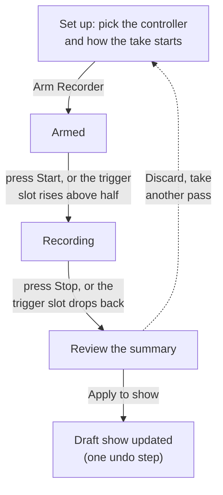

# Recording from a Console

Have a lighting console (or a rented programmer's board, or any DMX source) plugged into the IgorBox DMX? The recorder captures what it sends and converts it into a native IgorBox show: real fixture tracks you can edit, loop, and replay without the console.

## What you need

- A DMX controller targeted by the show, with **fixtures patched**. The recorder maps captured channels back onto your patch, and slots that aren't patched to any fixture are discarded. Patch first, record second.
- The controller in **Buffer** mode, or **Standard** mode with [DMX input enabled](dmx-input). (Fixture mode can't record; its hardware passthrough bypasses clean capture.)
- The controller online, and [Live Preview](/docs/studio/timeline-editor/live-preview) stopped; the two can't run at once.

A wiring note on the two modes: in **Buffer** mode your fixtures respond to the console live while you record, so you see the light show as you capture it. In **Standard** mode the input only listens; the console's signal doesn't pass through the IgorBox to your fixtures. If you want to watch the lights respond while you record, split the console's signal before it reaches the IgorBox (with a DMX splitter or Y-cable) so one leg feeds the IgorBox input and the other feeds the fixtures.

:::important Recording Requires DMX Input Active
You must have the DMX input turned on to to see the record button on the timeline editor!

:::

## Recording

Open the show in the timeline editor, park the playhead where the recording should land, and click **Record** in the top bar.

1. **Set up.** Pick the controller (if the show targets more than one eligible box) and choose how the capture starts:
   - **I press Start**: you're at the console yourself.
   - **DMX slot crosses 128**: hands-free. The recorder watches one slot and starts when the console pushes it above half, stopping when it drops back. Map a spare fader to that slot and the console operator controls the take.
2. **Arm Recorder.** The controller confirms in under a second and holds still for the capture (it enters manual control for the session).
3. **Record.** Press **Start** (or fire the console's trigger fader) and run the cue stack. A timer and frame counter tick while capture runs.
4. **Stop** (or let the trigger slot drop). The recorder flushes and processes the take.
5. **Review.** Before anything touches the show, you get the summary: how long the capture ran, which fixtures have data (and which sat idle), how many tracks and color groups will be created or replaced, and how many unpatched slots were discarded. Warnings appear here too.
6. **Apply to show**, or **Discard** and take another pass.

You can use the countdown from the browser or use your console to trigger the record start and stop with any DMX channel that you choose

## What Apply does

The capture is converted **through your fixture patch** into ordinary show data (dimmer envelopes, pan/tilt moves, state clips, and color stops on the fixtures' [color tracks](/docs/studio/timeline-editor/dmx-tracks)), not a frozen blob. It's all editable, exactly as if you'd authored it by hand.

- The recording lands **at the playhead position** you started from.
- Tracks *inside* the recorded window are overwritten; everything outside it is preserved. A longer take extends the show's duration.
- The whole recording is **one undo step**; Ctrl+Z takes it all back.
- The show returns to **draft**; [deploy](/docs/studio/timeline-editor/deploys-and-versions) when it's ready.

:::tip Capture once, then polish
The recorder gets a cue stack into IgorBox; the timeline editor makes it yours. Trim the dead air at the start, tighten a fade, swap a color. The recording is a starting point, not a photograph.
:::

## If the session drops

A recording session rides on a live connection to the controller. If the connection drops mid-take (network hiccup, controller reboot), the take is lost and the recorder tells you; the show isn't touched. Closing the recorder window mid-session likewise discards cleanly. Nothing half-applied ever lands in the show.
