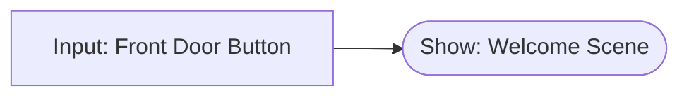
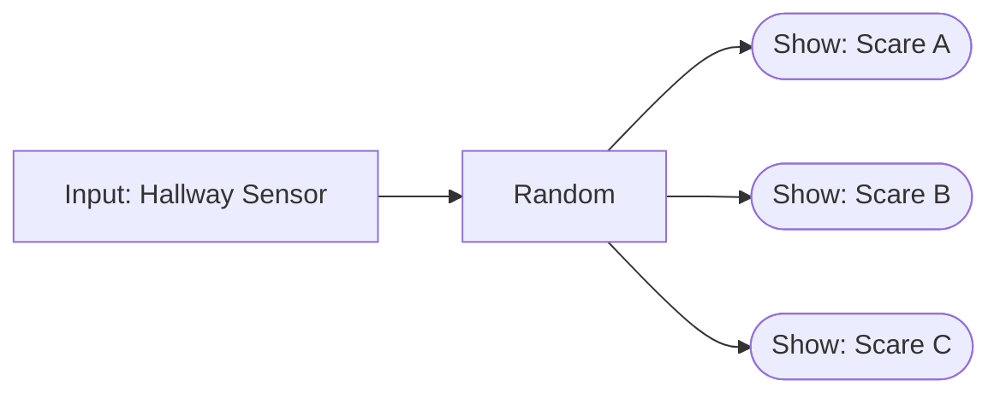
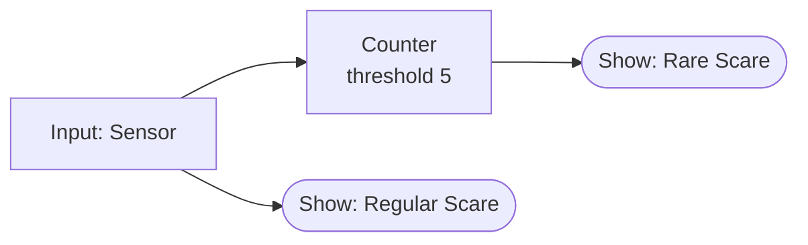
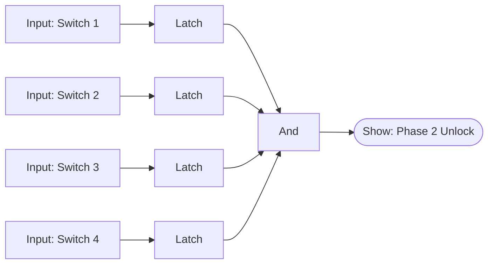
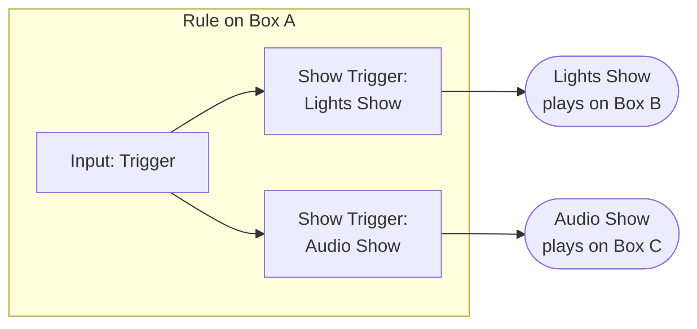
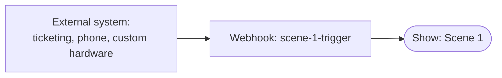
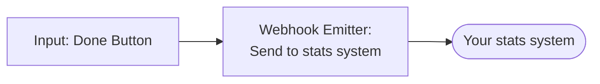
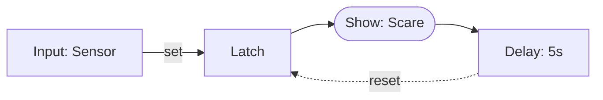
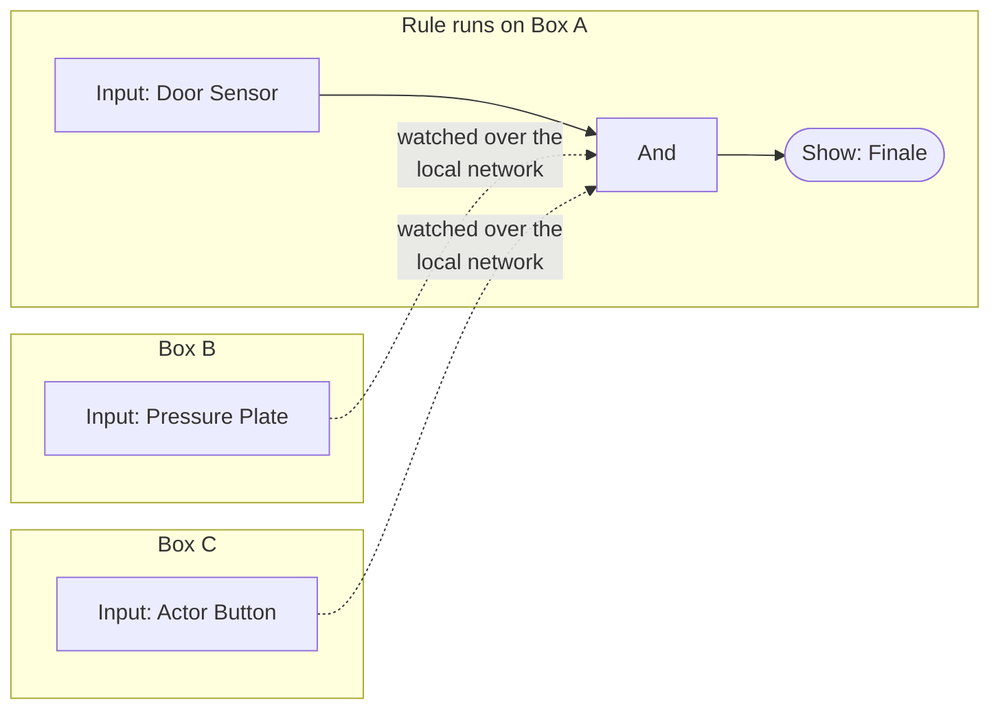

# Examples

A handful of Logic Rules patterns we've seen built across haunts, escape rooms, and immersive attractions. Use them as starting points and adapt to your install.

## 1. Simple input → show

The hello world. Wire a button to a show.

Use the [Triggers button](/docs/studio/triggers) on the show — this is exactly what it's for.

## 2. Random scare from a pool

Every guest who walks past the sensor gets a scare, but you have three different scares and you want them shuffled.

Set the Random block's output count to match your number of scares (here, three). Each guest gets one of the three picked at random, with equal odds. Want one scare to come up more often? Wire it to two of the outputs.

## 3. "Rare scare" every Nth guest

Most guests get the regular scare. Every fifth one gets a special one.

The Counter only fires once its input has fired 5 times. The regular scare fires every time. So guests 1–4 see Regular, guest 5 sees Rare *and* Regular.

By default the Counter fires once when it reaches 5 and then won't fire again until it's reset. Turn on its **Auto-reset** option to have it re-arm automatically after each interval — so the rare scare fires on the 5th guest, the 10th, the 15th, and so on.

If you want guest 5 to see Rare *instead of* Regular, add a Not-And gate to suppress Regular on the 5th guest.

## 4. Escape room: four switches in any order

Four magnetic switches must all be flipped to unlock the next phase. Order doesn't matter; all four must be set.

Each Latch captures a switch flip and holds it on. The And gate fires when all four latches are set. Add a reset input to each Latch (driven by a phase-reset button) so the room can be reset between groups.

## 5. Multi-controller coordination

Input on Box A fires a lighting show on Box B and an audio show on Box C.

A rule on any controller can fire a **Show Trigger** for any show in your Studio, including shows that run on other controllers. So Box A's input launches the lights on Box B and the audio on Box C just by firing each show's trigger. Firing shows across controllers is one cross-controller path; you can also watch another controller's input directly inside a rule (example 8 below, and the [Input block](node-reference)). Named Triggers, by contrast, only chain rules within the same controller.

## 6. Webhook bridge

External system fires a webhook → your show fires.

Studio gives you a unique URL for the webhook. Configure your external system to hit it. When it does, your show fires.

For the reverse direction (show fires → external webhook), use a Webhook Emitter:

See [Webhooks](/docs/studio/webhooks/inbound) for details.

## 7. Anti-spam with a delay

Sensor fires too frequently? Use a Latch + Delay + reset pattern to ignore re-triggers for a window.

The sensor fires the latch and the show. Five seconds later, the delay output resets the latch. Within the 5-second window, additional sensor fires don't re-trigger because the latch is already set.

## 8. Watching inputs on other boxes

The rule runs on **one** controller (the executor), but its Input blocks can watch inputs on **any** controller in your Studio. A dedicated input controller like the Input 16 makes a natural brain: it executes the logic while pulling signals from boxes all over the building.

Each Input block simply points at another controller's input instead of a local one; the signal rides the local network, so the boxes must share it. This is the mirror image of example 5: there, one input fired shows on many boxes; here, many boxes' inputs feed one rule.

## When examples aren't enough

If you've designed a rule and you're not sure if it's going to work, **deploy it and test it with Live Preview**. The rule runs in real time on the controller, and you can drive inputs from Manual Control to verify the logic without setting up the physical sensors.

For thornier debugging, drop us a note on [Discord](https://discord.igorbox.com) — we've seen most patterns and can usually point you at the right approach.
