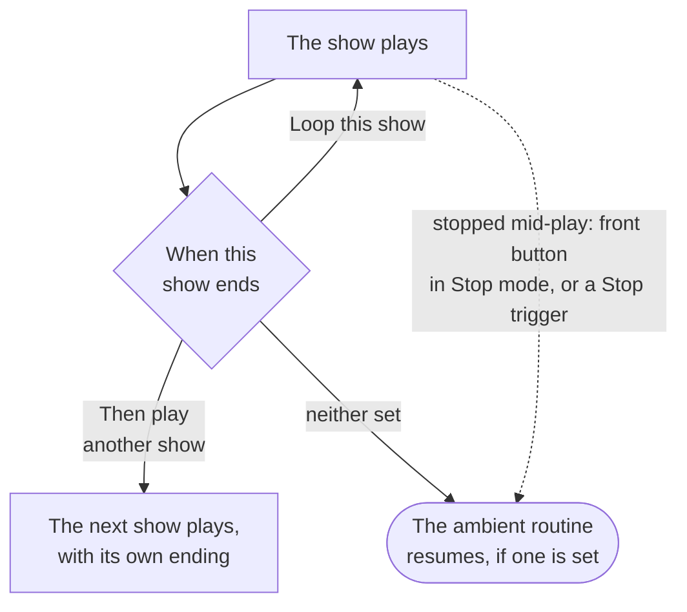

# Looping & Chaining

A show doesn't have to be one-and-done. From a show's settings you can make it **loop**, **hand off to another show** when it finishes, or be **stopped** on cue — which lets you build sequences and idle states without wiring up extra logic.

Open a show in the editor and click the **gear icon** (Show Settings) in the toolbar. The options below live under **When this show ends**.

## Loop a show

Turn on **Loop this show** and the show restarts from the beginning the moment it finishes, then keeps looping until something takes over — a trigger fires another show, an operator starts Manual Control, or the front button stops it.

This is perfect for idle and attractor states. (If a show is already set as a controller's [ambient routine](/docs/studio/ambient-routines), it loops as ambient automatically and this toggle is hidden.)

## Chain to the next show

Pick a show from **Then play another show** and that show starts automatically the moment this one finishes. Stitch several shows into one sequence without any rules.

- Leave it empty to just stop when the show ends.
- Looping and chaining are mutually exclusive — turning on **Loop this show** disables the hand-off, and picking a next show turns looping off.
- If the show you pick isn't deployed yet, Studio warns you: the hand-off won't happen on hardware until that show is deployed too.

## Stop a show

A show plays until it ends (or loops) — unless something stops it. You can stop a running show by:

- Pressing the **front button** when it's set to [Stop mode](/docs/studio/front-button-modes).
- Firing a **Trigger** (or a rule) whose action is set to **Stop** — see [Triggers](/docs/studio/triggers).

When a show is stopped, the controller returns to its [ambient routine](/docs/studio/ambient-routines) if one is set.
