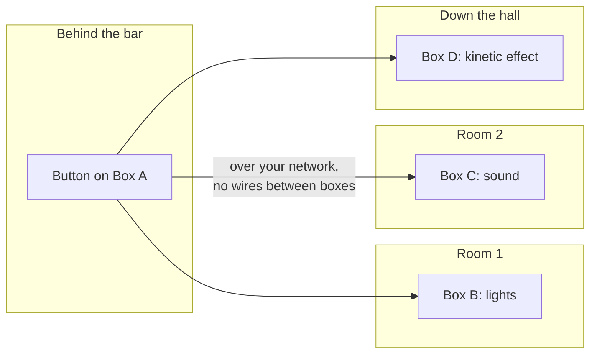

# IgorBox for Themed Entertainment & Immersive Events

Whether it's a dark ride, an immersive theatre piece, a museum exhibit, a retail activation, or an interactive photo op, themed entertainment is about a space that responds — lights, sound, motion, and effects acting as one. IgorBox gives you frame-accurate show control for all of it, designed on a timeline and triggered by the audience.

No programming. Build the moment, wire the effects, and let guests set it off.

The entire show lives on the controller(s) and comes up and starts working as soon as it's powered on. Great for on-site installs where daily reliability through power cycles is a requirement. The controllers don't need internet to run, but if the controller is connected to the internet, you can monitor and reprogram remotely without going to the location. 

## What you can build

- **Synchronized shows** — lighting, audio, and motion locked to one timeline so every cue lands together.
- **Interactive moments** — a guest presses, steps, or waves, and the space reacts.
- **Dynamic lighting** — smooth dimming and color for scenes, washes, and reveals.
- **Photo ops & activations** — a button kicks off a lighting-and-effects sequence for the shot.
- **Multi-room coordination** — controllers across the space talk to each other so one trigger can run a cue anywhere.
- **Trigger from anywhere** — wire a single button to one controller (behind the bar, under the counter) and it fires a fully coordinated show across every *other* controller in the space. You never run wires between controllers — they coordinate over your network, so a button on box A drives the lights, sound, and effects on boxes B, C, and D.
- **Tie into existing infrastructure** — with [webhooks](/docs/studio/webhooks/inbound) (a Pro/Enterprise feature), you can tie show triggering to anything that can call a URL. When a sale is made or a milestone is reached in your existing POS system, website, or mobile app, the location can come alive.

## Which IgorBox for which job

| The job | Use this |
| --- | --- |
| Switch effects, foggers, motors, and powered props | [Output 8](/docs/controllers/output-8-mkii/overview) |
| Read guest interactions — buttons, sensors, beams | [Input 16](/docs/controllers/input-16/overview) |
| Dimmable and color lighting, LED strips, fixtures, and DC [motor speed control](/docs/controllers/led-controller/motor-speed-control) | [LED Controller](/docs/controllers/led-controller/overview) |

Because IgorBox controllers coordinate over your network, a single interaction can fan out into a whole-space cue — lights in one room, sound in another, a kinetic effect down the hall.

## How it works

1. **Wire it** — [Easywire™](/docs/controllers/shared/easywire) walks you through each effect and input.
2. **Design the show** — lay lighting, audio, and motion on the [timeline](/docs/studio/timeline-editor/basics) and shape smooth moves.
3. **Make it interactive** — a [Trigger](/docs/studio/triggers) connects a guest action straight to a show; use [Logic Rules](/docs/studio/logic-rules/overview) when a moment needs combinations, sequencing, or timing.

## Common patterns

- **Press-to-play:** a guest presses a button → a synchronized light-and-sound sequence runs, then resets.
- **Ambient loop with takeover:** an [ambient routine](/docs/studio/ambient-routines) runs continuously until an interaction triggers a feature moment, then resumes.
- **Scene changes:** one trigger swaps an entire room to a new lighting and audio scene.

## Get started

- New here? Start with the [documentation home](/docs/intro).
- Explore the hardware: [Output 8](/docs/controllers/output-8-mkii/overview), [Input 16](/docs/controllers/input-16/overview), [LED Controller](/docs/controllers/led-controller/overview).
- Learn the show tools in [IgorBox Studio](/docs/studio/overview) and [Logic Rules](/docs/studio/logic-rules/overview).
- See also the [FAQ](/docs/faq) and the [Glossary](/docs/glossary).
